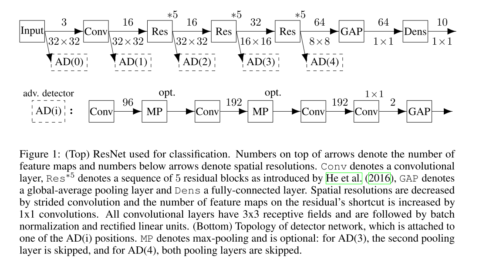

```
@inproceedings{DBLP:conf/iclr/MetzenGFB17,
author = {Metzen, Jan Hendrik and Genewein, Tim and Fischer, Volker and Bischoff, Bastian},
booktitle = {5th International Conference on Learning Representations, {\{}ICLR{\}} 2017, Toulon, France, April 24-26, 2017, Conference Track Proceedings},
file = {:E$\backslash$:/GoogleDrive/{\#}BAI TAO{\#} Adversarial ML/Mendeley/2017 - On Detecting Adversarial Perturbations.pdf:pdf},
publisher = {OpenReview.net},
title = {{On Detecting Adversarial Perturbations}},
url = {https://openreview.net/forum?id=SJzCSf9xg},
year = {2017}
}
```

The main idea of this paper is quite simple, attaching a detector of adversarial examples with a regular classifier. Something original is that they extended it to a dynamic senerio and proposed dynamic adversary training. 

I do not understand the architechture of their networks.

