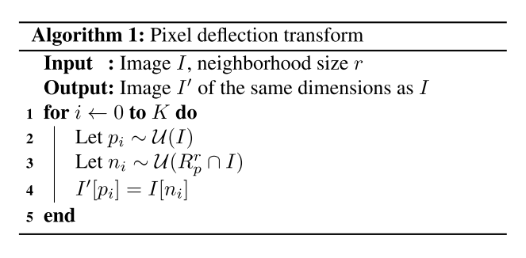

```
@inproceedings{DBLP:conf/cvpr/PrakashMGDS18,
author = {Prakash, Aaditya and Moran, Nick and Garber, Solomon and DiLillo, Antonella and Storer, James A},
booktitle = {2018 {\{}IEEE{\}} Conference on Computer Vision and Pattern Recognition, {\{}CVPR{\}} 2018, Salt Lake City, UT, USA, June 18-22, 2018},
doi = {10.1109/CVPR.2018.00894},
pages = {8571--8580},
publisher = {{\{}IEEE{\}} Computer Society},
title = {{Deflecting Adversarial Attacks With Pixel Deflection}},
url = {http://openaccess.thecvf.com/content{\_}cvpr{\_}2018/html/Prakash{\_}Deflecting{\_}Adversarial{\_}Attacks{\_}CVPR{\_}2018{\_}paper.html},
year = {2018}
}
```
Pixel deflection and wavelet transform.

## Motivation
Image classifiers tend to be robust to natural noise, and adversarial attacks tend to be agnostic to object location.

These observations motivate our strategy, which leverages model robustness to defend against adversarial perturba- tions by forcing the image to match **natural image statistics**.

<span style="color:red">what is natural image statistics?</span>

## Two techniques
### Pixel deflection.

even changing as much as $1\%$ of original pixels does not alter the classification of a clean image.



### adaptive soft-thresholding in the wavelet domain.

## Targeted Pixel Deflection
Utilized the localization of objects.
- Class activation map.
- saliency maps.

### robust activation map
they used an exponentially weighted average of teh maps of the top-k classes.

$$\widehat{M}(x, y)=\sum_{i}^{k} \frac{M_{c_{i}}(x, y)}{2^{i}}$$


## Wavelet denoising with adaptive thresholding