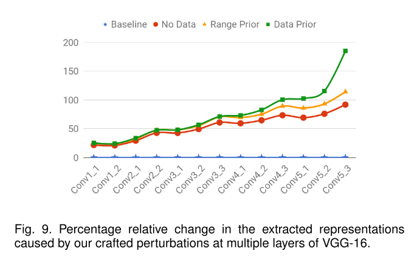

```
@article{8423654,
address = {Los Alamitos, CA, USA},
author = {Mopuri, K and Ganeshan, A and Babu, R},
doi = {10.1109/TPAMI.2018.2861800},
issn = {1939-3539},
journal = {IEEE Transactions on Pattern Analysis {\&} Machine Intelligence},
keywords = {data models,feature extraction,image segmentation,machine learning,perturbation methods,task analysis,training data},
month = {oct},
number = {10},
pages = {2452--2465},
publisher = {IEEE Computer Society},
title = {{Generalizable Data-Free Objective for Crafting Universal Adversarial Perturbations}},
volume = {41},
year = {2019}
}
```

## Motivation
Existing methods to craft universal perturbations are 
- task specific
- require samples from the training data distribution
- perform complex optimizations

Fooling ability of the crafted perturbations is proportional to the available training data.

**The focus of the proposed work is to craft $\delta$ without requiring any data samples**.

## Methods

Objective function:
$$\text { Loss }=-\log \left(\prod_{i=1}^{K}\left\|l_{i}(\delta)\right\|_{2}\right), \quad \text { such that } \quad\|\delta\|_{\infty}<\xi$$

With priors:
$$
\operatorname{Loss}=-\sum_{d \sim \mathcal{N}(\mu, \sigma)} \log \left(\prod_{i=1}^{K}\left\|l_{i}(d+\delta)\right\|_{2}\right)
$$
such that $\|\delta\|_{\infty}<\xi$

$$\begin{aligned}
&\text { Loss }=-\sum_{x \sim \mathcal{X}} \log \left(\prod_{i=1}^{K}\left\|l_{i}(x+\delta)\right\|_{2}\right)\\
&\text { such that }\|\delta\|_{\infty}<\xi
\end{aligned}$$

They proposed a adaptive re-scaling of $\delta$ based on the rate of saturation(reaching the extreme values of the constraint). This re-scaling operation not only allow an improved utilization of the gradients, it also retains the pattern learnt in the optimization process till that iteration.

**Changes resulted by the perturbation.**

