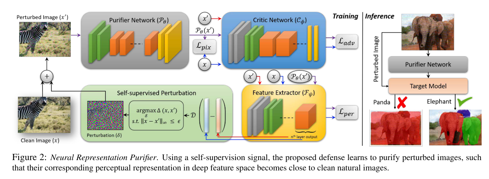

```
@inproceedings{Naseer_2020_CVPR,
author = {Naseer, Muzammal and Khan, Salman and Hayat, Munawar and Khan, Fahad Shahbaz and Porikli, Fatih},
booktitle = {IEEE/CVF Conference on Computer Vision and Pattern Recognition (CVPR)},
month = {jun},
title = {{A Self-supervised Approach for Adversarial Robustness}},
year = {2020}
}
```
## Motivation
- Adversarial training that enhances robustness by modifying target model's parameters lacks generalizability of cross-task protection. 
- Different input processing based defenses fall short in the face of continuously evolving attacks.
- Our defense aims to combine the benefits of adversarial
training and input processing methods in a single frame-
work that is computationally efficient, generalizable across
different tasks and retains the clean image accuracy. 
- Combine the pre-processing and adversarial training.
- build a robust denosier

## Contribution
- A self-supervised way to generate adversarial perturbations, which is proved to be transferable. 
- using the adversarial training scheme to train the robust purifier.


